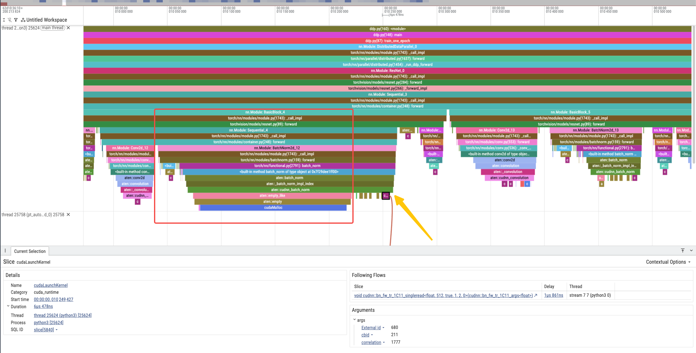

# 训练与推理的优化

# 在做什么？

<del>就是优化训练和推理</del>

对AI模型训练和推理过程中，在给定模型的背景下，在给定的硬件资源下，充分榨干硬件，实现某种吞吐或者latency的最大化，并且保证可靠性和数值稳定性；

- 什么是模型？
    - 模型是`模型权重`+`计算方法`
- 什么是训练？
    - 训练是根据给定数据，通过训练算法**更新模型权重**
- 什么是推理？
    - 在已有`模型权重`下，输入数据，执行`计算方法`
    - 所以训练和推理的一大根本区别在于：**`模型权重`有没有得到更新**
    - 由于`模型权重`无需更新，所以用来更新`模型权重`的组件也不存在


# 需要知道什么？

- 模型的计算过程（可以不知道算法或数学意义的过程）
- 给定硬件条件的性能边界（以及什么叫“性能”）
- 已有的加速技术
- 排查性能瓶颈的能力
- 良好的coding功底（做模拟题，把想法快速实现出来，一般不涉及到复杂的语言特性）
- Python基础

# 一些时代背景

1. 现在是5202年
    - 除了LLM（及其衍生mllm、vlm、扩散模型、dit、wm、vla、lrm等）基本可以开除ai籍
    - 除了自回归（token）和diffusion外，其他决策方法可以开除learning籍
    - 不再有所谓静态图和动态图的争论
    - Torch和huggingface已经完成大一统，并且基本作为RFC存在
    - 各硬件层次的通信带宽逐渐成为所有性能问题的根因，越发明显
    - Pythonic思想贯彻大部分场景开发思想
        - 从顶层到底层，**每一层的代码都是对下一层的调度**，每一层都尽量不涉及实际密集运算，只有逻辑控制
        - **因此**，调度代码需要尽量动态灵活，从而快速排查、实现、定位、分析性能和迭代，而涉及具体底层过程使用dlopen的形式引入
        - **因此**，DSL（Domain-Specific Language, 领域特定语言）成为潮流，可以认为torch已经是一种DSL而非框架；simd和cuda等高性能计算编程也逐渐DSL化
        - **因此**，从pythonic的最上层往底层来看，每一层都像是一个compiler，需要通过compiler来降低overhead，以及做IR优化
        - "层"不等于"编程语言层次"
    
2. 分布式并行计算成为标配
    - 除了端侧，几乎不再存在不需要分布式并行推理/训练的场景
    - <del>（甚至端侧也有明显脱离单node趋势）</del>
    - 如何充分利用多硬件节点成为优化的主要问题
    - 由于node的增多，已经不能无视单node出现各种问题的几率
        - 例如，单个node故障率哪怕只有0.01%，在233个node持续以榨干性能的姿态运行长时间的情况下，故障率可以接近100%
    - 分布式共识反而不会成为问题，CAP不可能三角中可以最大化可用性和容忍性，几乎可以不考虑一致性，因为分布式训推的并行策略已经可以事先对数据进行schedule

# Roadmap

## Common

训推都需要知道的知识

### torch的基本使用和单卡最小训练过程

学会torch的官方教程，https://docs.pytorch.org/tutorials/beginner/basics/intro.html

用最新版本pytorch学会跑左边的“Learn the Basics”

别怕，不需要了解具体算法和数学原理，比如：
- 为什么模型要这么设置
- 为什么要有梯度下降
- 梯度是什么
- 反向传播为什么是这样计算，为什么要反向传播
- loss为什么这么算以及loss计算的数学意义

等等，也不需要知道为什么训练模型或者推理模型是这样的过程

学完后，你应该掌握了：
1. torch tensor的基本使用
2. torch的常见操作
3. （单卡）训练需要的组件和概念
    - `dataloader`、模型、`optimizer`、`loss`、`forwoard`、`backward`、`optimizer.step`、模型权重（checkpoint）
4. 所谓的模型是一个有向无环图，这个图叫计算图，每个节点是一个计算过程（`Function`或者说`Layer`或者是`Module`）和输入输出与权重（`Tensor`）和梯度（`grad`），节点之间边的方向是fwd时的运算顺序
    - `数据tensor`为`src`，`loss`为`tgt`
    - 所谓的`forward`(之后简称fwd)是从`src`开始执行到`tgt`，不断执行每个节点的fwd，每个节点的fwd都是前驱节点的fwd结果
    - 所谓的`backward`(之后简称bwd)是从`tgt`执行到`src`，不断执行每个节点的bwd方法，每个bwd的输入是后继节点的bwd结果，后继节点的bwd结果存在当前节点fwd输出tensor（=后继节点fwd输入）的`.grad`中
5. torch看起来是以`torch.nn.Module`作为某种基本组成单元的
6. 如果fwd过程都使用torch有的function，似乎我们没有编写bwd过程，这说明torch帮我们实现了，这也是torch最原始的定位：自动求导框架（autograd）


那么我们可以得到一个最小的训练过程：

：

```python
dataloader = Dataloader(...) # 负责从某存储读取数据并打包为训练数据，我们先不管他
model = Module(...) # 模型定义，我们先不考虑模型具体形态
loss_fn = Loss(...) # loss函数的定义
optimizer = torch.optim.Adam(model.parameters(), ...) # 注意model.parameters()是要更新的模型权重的集合

def train_loop(dataloader, model, loss_fn, optimizer):
    size = len(dataloader.dataset)
    model.train()
    for batch, (X, y) in enumerate(dataloader):
        # 从X到loss，这一步叫fwd
        pred = model(X)
        loss = loss_fn(pred, y)

        # torch的autograd机制，从loss在计算图上反向遍历更新每个tensor的.grad
        # 这一步叫bwd
        loss.backward()
        # bwd结束后，计算图的每一个tenso都有了.grad梯度

        # 执行optimizer，根据待更新权重的grad和原数值，计算新数值并写回权重tensor
        optimizer.step()

        # 权重更新完了，清空所有tensor的grad，准备下一轮
        optimizer.zero_grad()

        # 我们把这个训练循环里的单次迭代，叫做“一个训练step”

```

此时，我们完全不需要知道model的算法细节，只需要知道他是一个model


### 拓展到单机多卡和多机多卡

我们已经了解了单卡训练的最小方式，那么我们可以问问伟大的gpt老师，怎样把这个过程拓展到单机多卡（ddp）和多机多卡（ddp），代码可以是一致的

[参考这个训练代码](./codes/ddp.py)，使用方式在代码中

我们可以先看看和单卡最小训练相比，多了什么东西呢？

- 启动方式变了，变成了[torchrun](https://docs.pytorch.org/docs/stable/elastic/run.html)，并且输入的时候有一些参数
- 变成多进程，看起来一个进程会使用一张卡
- 除了单卡有的之外，还多了[torch distributed](https://docs.pytorch.org/docs/stable/distributed.html)的init等处理
- Dataloader多了[DistributedSampler](https://docs.pytorch.org/docs/stable/data.html#torch.utils.data.distributed.DistributedSampler)
- 代码里面多了一堆读取的环境变量，多了`rank`的概念
- 代码里面model包了一层[DistributedDataParallel](https://docs.pytorch.org/docs/stable/generated/torch.nn.parallel.DistributedDataParallel.html#torch.nn.parallel.DistributedDataParallel)
    - 这是啥呢

好，我们先到这里，在此之前我们先想办法看看，单卡和多卡的训练step分别发生了什么吧

### 使用profiler工具了解每个训练steo过程发生了什么

#### 跑一个profiler文件

你已经学会跑`ddp.py`了，所以可以把[ddp_with_profiler.py](./codes/ddp_with_profiler.py)也跑了，自己看懂参数跑一下

跑完后会在`/tmp/`下生成若干个`trace_*.json`，然后运行[merge_profiler.py](./code/merge_profiler.py)(ai写的)，会得到`/tmp/trace_merged.json`, 我们把这个merge json丢到[perfetto.dev](https://ui.perfetto.dev/)中打开

perfetto按`A/D`是左右平移，按`W/S`是按中心大小缩放，选中一个活动之后按`F`可以放大到中间，按`Q`可以开关底部信息区；更详细的用法以及sql查询请问gpt老师，我们大部分情况下最多只需要按名字搜索某个活动（在perfetto里面叫event），建立一个新的workspace：


然后把所有不是`threading.py(995): _bootstrap`这样的活动（cpu和gpu都要），按最左侧timeline名右上角的省略号，copy到新建的workspace中

在`assets`里面分别准备了在H20上的[单卡](../assets/stage_0/perfetto/trace_single.json.gz)和[2卡ddp](../assets/stage_0/perfetto/ddp_2ranks.json.gz)的profiler，我们以这两个为例，放到perfetto后再经过调整可以得到类似：


然后我们在单卡训练也这样做一个profiler，放到新的perfetto窗口打开.

timeline的最左边，会发现有stream和thread两种timeline，分别对应gpu和cpu的活动。

timeline的组织形式是：进程/线程(stream)

cpu活动中会有我们这份代码中ddp的详细堆栈，我们可以放大，在尾巴里找到有`cudaLaunchKernel`的cpu活动，会发现他有一条曲线连在gpu活动，表示对应关系。

在多卡的profiler里，我们随便点开stream里的一个gpu活动，可以看到：


- 这个gpu活动显然不是python里的计算，并且不在cpu上执行
    - category叫：`Kernel`
    - 名字看起来很长但是明显有一定的格式，比如：`sm90_xmma_dgrad_implicit_gemm_f32f32_tf32f32_f32_nhwckrsc_nhwc_tilesize128x64x32_warpgroupsize1x1x1_g1_execute_segment_k_on_kernel__5x_cudnn`
    - 注意这个名字和卡以及各个库的版本有关，所以我们看到的不是一样的，但你一定能发现类似这样格式命名的kernel
    - **这样的kernel是负责计算的**
- 有一条线连接到cpu上的一个`cudaLaunchKernel`，我们在信息栏里面会看到：`Category: cuda_runtime`
    - 这个`cudaLaunchKernel`上层的调用活动，比如`XXXXBackward`，信息栏会看到：`Category: cpu_op`
- 我们还发现相比于单卡的profiler，多卡时每个有`stream timeline`的进程多了一个stream，这个stream类似上图中的`ncclDevKernel_AllReduce_Sum_f32_RING_LL`和`nccl:all_reduce`
    - 并且这个nccl的stream里面，`ncclDevKernel_AllReduce_Sum_f32_RING_LL`也是：`Category: Kernel`
    - 而且nccl的stream和计算的stream不是同一个
    - **这样的kernel是负责通信的**

除此之外，gpu的活动的timeline计算部分非常稀疏，存在很多空泡，因为这是timeline，空泡一定是没有活动

且通信部分一个rank特别长，另一个短很多，但通信又基本上是同时结束的

我们再看看cpu部分：



显然有明显的从上到下调用关系，活动的名字是`文件路径(行数): function名`格式，并且看起来，最底层都是一个`cuda runtime`的活动，即命名都是`cudaXXXXXX`

好了，我们先看到这，还有很多可以挖掘的信息，但我们先解决一下我们这里提到的一些问题

- 拓展项：
    - [ddp_with_profiler.py](./codes/ddp_with_profiler.py)的训练过程多了一些东西：
        - `dist.barrier()`
        - `torch.cuda.synchronize()`
        - `record_function`
        - warmup
    - 有兴趣的话可以问问gpt他们的用处，以及为什么我们在profiler的时候用了这些功能
    - 我们后面会讲到

### GPU的基本概念

TODO

### 集合通信

我们在profiler里看到了`ncclDevKernel_AllReduce_Sum_f32_RING_LL`这个kernel，显然有格式：
- `ncclDevKernel`: 我们忽略DevKernel，`nccl`是NVIDIA Collective Communications Library，是NVIDIA在NV GPU上的集合通信库，所以这个kernel来自这个集合通信库
- `AllReduce`：这是一种通信原语，表示这个kernel执行的是这种通信原语。**后面的都是这个原语的参数**
    - `Sum`： 求和，为什么这里有个求和呢？
    - `f32`：显然是数据类型fp32，但为什么这里有个数据类型？
    - `RING`：为什么有“环“这个词出现？
    - `LL`：我可以先剧透，这个简称是指Low Latency，但这具体是什么呢？

`nccl`看起来就是个名词，没什么好说的，但是`AllReduce`这种通信原语是什么呢，通信原语有哪些呢，以及，什么叫“集合通信“呢？为什么有“集合“两个字？

#### 必要概念

以目前的实践方式来说，我们会默认：
- 一个`gpu` = 一个`进程`(实践上) = 一个`rank` = 一个`device`
- 一个`机器` = 一个`Node` = 若干个`gpu`（一般是8-10）
- 一个`集群` = 若干`机器` + 机器之间的网络拓扑 + 每个机器的device之间的网络拓扑

rank是指gpu中的编号，比如有n张卡，那么rank范围是$[0, n)$，同时这里的$n$也是world size

所以一个rank也会区分是“全部机器的全部gpu”的`global rank`，还有本地机器的`local rank`，默认我们都认为`rank = global rank`

此外，在一些场景中需要计算某个`Node`在所有`Node`中的编号，再计算出实际的`device`的`rank`，所以也会有`node rank`，但总之，没有特意指明时，`rank`就是`device`的`global rank`

#### 集合通信与点对点通信

我们熟悉的通信比如socket，会有send和recv，我们把这样的通信称为：`点对点通信 (P2P)`，只需要两者约定好即可，像是游戏里的私聊。

所谓的集合通信，是指有多个通信参与者，约定好一个通信原语，完成后各自获得某种结果。

就像：有多个人，预定了一个聊天室，约定了一个讨论内容，每人完成自己负责的部分，最后大家拿着讨论结果走人。

注意我们接下来默认：一个通信参与者 = 一个rank = 一个进程

- 点对点通信：rank $i$明确发送信息给rank $j$，rank $j$明确的接受从rank $i$发送的信息

例如同一时间，rank $i$的进程中明确执行了代码：

```python
send(message, j)
```

而rank $j$的进程明确的执行了代码：

```python
message = recv(i)
```


- 集合通信：rank $i,j,k,z$约定一起参与通信，每个rank的进程都会负责同样的发送或者接受的行为顺序，最后rank $i,j,k,z$都获得了这种约定的结果。

比如rank $i,k,k,z$的进程都执行了代码：

```python
result = collective_communication_op(message, [i, j, k, z])
```

所以我们在coding时需要预先设置好：

- 点对点通信的规则
- 参与集合通信的rank集合，以及约定了什么样的通信

这是类似“编译期”需要指定的内容，如果有“运行时”的更改，那么也需要通过通信机制让所有进程感知，但这种“运行时”的更改也一定从某种“编译期”的规则出发。

所以我们可以认为：集群通信的实际形态都应该是“编译期”可确定的。

此外，稍微思考可以发现：**对于集合通信，各个rank可以不同时开始，但是一定会同时结束**


#### 集合通信原语

我们来列举一下常见的集合通信原语有哪些吧，接下来假设存在rank $0,1,2,3$，分别为进程$P0, P1, P2, P3$

##### Barrier

rank $0,1,2,3$不传输数据，直接结束。

类似进程里都有代码：
```python
barrier()
```

没传数据那能做什么？由于集合通信会同时结束，所以本质上这是一次进度同步，让四个rank的进程同步到某行指令

##### BroadCast

将rank $0,1,2,3$的其中一个rank的数据，广播到$0,1,2,3$，最后的结果是：rank $0,1,2,3$有同样的数据。


##### Scatter

将rank $0,1,2,3$的其中一个rank的数据，按顺序(一般是rank的数值顺序)分拆给其他rank。最后的结果是$0,1,2,3$分别有了其中的1/4


##### Gather

将rank $0,1,2,3$各自的数据汇聚在一个rank里，最后的结果是，目标rank有了其他所有rank的数据，按数值顺序排列(其他rank无所谓结果)


##### Reduce

将rank $0,1,2,3$各自的数据**经过某种操作后**汇聚在一个rank里


可以发现和`Gather`非常像，区别在于**通信过程中**，多了一次“某种操作“。

这种操作常见：Sum、Mul，即累加和累乘

- 拓展问题：**通信过程中**，多了一次“某种操作“，意味着什么？

##### All Gather

简称`AG`

可以理解为：把`Gather`的结果再`BroadCast`给所有rank。
- 注意只是能这么理解，不是说实际上拆分成了这两种原语


##### All to All

简称`A2A`

rank $0, 1, 2, 3$各自把自己的数据拆成$n = 4$份，这样比如rank $0$的数据变为：`rank[0][0], rank[0][1], rank[0][2], rank[0][3]`，其他rank类似。

我们用`rank[i][j]`表示rank $i$的第$j$份数据。

`A2A`的做法是，让每个`rank[i][j]`都变成`rank[j][i]`

聪明的你可能发现了，我们的矩阵转置就是这个过程，但A2A不局限于二维矩阵转置：即每份数据不一定是一个元素。


##### ReduceScatter

简称`RS`

每个rank的数据分拆，然后每个rank做一次Reduce，再将结果置于分拆后的对应位置。


##### All Reduce

简称`AR`

和`Gather` / `All Gather`的关系同理，可以理解成是把`Reduce`的结果`BroadCast`一遍
- 注意只是能这么理解，不是说实际上拆分成了这两种原语

注意，既然有`Reduce`，所以也带有“某种操作“


#### Torch中怎么使用集合通信

在PyTorch中，集合通信主要通过torch.distributed模块实现。下面我们将详细介绍如何在PyTorch中使用各种集合通信原语。
在使用集合通信之前，需要先初始化分布式环境。

```python

def setup_process(rank, world_size, backend):
    """
    初始化分布式环境

    参数:
        rank: 当前进程的rank
        world_size: 总进程数
        backend: 指定后端 ('gloo', 'nccl')

    返回:
        rank, world_size, pid
    """
    # 设置通信地址
    os.environ['MASTER_ADDR'] = '127.0.0.1'
    os.environ['MASTER_PORT'] = '29500'

    # 跨平台网络接口设置 (仅Gloo需要)
    if backend == 'gloo':
        system = platform.system()
        if system == "Darwin":  # macOS
            os.environ['GLOO_SOCKET_IFNAME'] = 'lo0'
        elif system == "Linux":
            os.environ['GLOO_SOCKET_IFNAME'] = 'lo'
        # Windows不需要设置

    # 初始化进程组
    dist.init_process_group(
        backend=backend,
        rank=rank,
        world_size=world_size
    )

    # 如果使用NCCL，设置GPU设备
    if backend == 'nccl':
        if not torch.cuda.is_available():
            raise RuntimeError("NCCL backend requested but CUDA is not available")
        # 单GPU情况下，所有rank共享同一个GPU
        # 多GPU情况下，每个rank使用不同的GPU
        if torch.cuda.device_count() >= world_size:
            torch.cuda.set_device(rank % torch.cuda.device_count())
        else:
            torch.cuda.set_device(0)

    return rank, world_size, os.getpid(), backend


```

1. Broadcast

    将指定rank的数据广播到所有进程。

```python

def run_broadcast(rank, world_size):
    """
    Broadcast操作：rank0的数据广播到所有进程

    预期输出（3个rank）：
    Rank 0 (pid: 12345) of 3: Before broadcast: tensor([[10., 10., 10.], [10., 10., 10.], [10., 10., 10.]])
    Rank 1 (pid: 12346) of 3: Before broadcast: tensor([[0., 0., 0.], [0., 0., 0.], [0., 0., 0.]])
    Rank 2 (pid: 12347) of 3: Before broadcast: tensor([[0., 0., 0.], [0., 0., 0.], [0., 0., 0.]])
    Rank 0 (pid: 12345) of 3: After broadcast: tensor([[10., 10., 10.], [10., 10., 10.], [10., 10., 10.]])
    Rank 1 (pid: 12346) of 3: After broadcast: tensor([[10., 10., 10.], [10., 10., 10.], [10., 10., 10.]])
    Rank 2 (pid: 12347) of 3: After broadcast: tensor([[10., 10., 10.], [10., 10., 10.], [10., 10., 10.]])
    """
    rank, world_size, pid = setup_process(rank, world_size)

    # 只有rank 0有初始数据
    tensor = torch.ones(3, 3) * (10 if rank == 0 else 0)

    print(f"Rank {rank} (pid: {pid}) of {world_size}: Before broadcast: {tensor}")

    # 从rank 0广播数据
    dist.broadcast(tensor, src=0)

    print(f"Rank {rank} (pid: {pid}) of {world_size}: After broadcast: {tensor}")

    cleanup()

```

2. Scatter

    将数据从一个rank分散到所有rank。

```python


def run_scatter(rank, world_size):
    """
    Scatter操作：rank0的数据分散到所有进程

    预期输出（3个rank）：
    Rank 0 (pid: 12345) of 3: Before scatter: tensor([[0., 0., 0.], [0., 0., 0.], [0., 0., 0.]])
    Rank 1 (pid: 12346) of 3: Before scatter: tensor([[0., 0., 0.], [0., 0., 0.], [0., 0., 0.]])
    Rank 2 (pid: 12347) of 3: Before scatter: tensor([[0., 0., 0.], [0., 0., 0.], [0., 0., 0.]])
    Rank 0 (pid: 12345) of 3: After scatter: tensor([[1., 1., 1.], [1., 1., 1.], [1., 1., 1.]])
    Rank 1 (pid: 12346) of 3: After scatter: tensor([[2., 2., 2.], [2., 2., 2.], [2., 2., 2.]])
    Rank 2 (pid: 12347) of 3: After scatter: tensor([[3., 3., 3.], [3., 3., 3.], [3., 3., 3.]])
    """
    rank, world_size, pid = setup_process(rank, world_size)

    # 准备接收张量
    recv_tensor = torch.zeros(3, 3)

    # 只有rank 0准备发送数据
    if rank == 0:
        send_tensors = [torch.ones(3, 3) * (i + 1) for i in range(world_size)]
        print(f"Rank {rank} (pid: {pid}) of {world_size}: Before scatter: {recv_tensor}")
    else:
        send_tensors = None
        print(f"Rank {rank} (pid: {pid}) of {world_size}: Before scatter: {recv_tensor}")

    # 执行scatter
    dist.scatter(recv_tensor, send_tensors, src=0)

    print(f"Rank {rank} (pid: {pid}) of {world_size}: After scatter: {recv_tensor}")

    cleanup()


```

3. Gather

    将所有rank的数据收集到一个指定的rank

```python

def run_gather(rank, world_size):
    """
    Gather操作：所有rank的数据收集到rank0

    预期输出（3个rank）：
    Rank 0 (pid: 12345) of 3: Before gather: tensor([[1., 1., 1.], [1., 1., 1.], [1., 1., 1.]])
    Rank 1 (pid: 12346) of 3: Before gather: tensor([[2., 2., 2.], [2., 2., 2.], [2., 2., 2.]])
    Rank 2 (pid: 12347) of 3: Before gather: tensor([[3., 3., 3.], [3., 3., 3.], [3., 3., 3.]])
    Rank 0 (pid: 12345) of 3: After gather - Received tensors:
        Rank 0 data: tensor([[1., 1., 1.], [1., 1., 1.], [1., 1., 1.]])
        Rank 1 data: tensor([[2., 2., 2.], [2., 2., 2.], [2., 2., 2.]])
        Rank 2 data: tensor([[3., 3., 3.], [3., 3., 3.], [3., 3., 3.]])
    Rank 1 (pid: 12346) of 3: After gather: tensor([[2., 2., 2.], [2., 2., 2.], [2., 2., 2.]])
    Rank 2 (pid: 12347) of 3: After gather: tensor([[3., 3., 3.], [3., 3., 3.], [3., 3., 3.]])
    """
    rank, world_size, pid = setup_process(rank, world_size)

    # 每个rank准备自己的数据
    send_tensor = torch.ones(3, 3) * (rank + 1)

    # 只有rank 0准备接收缓冲区
    recv_tensors = [torch.zeros(3, 3) for _ in range(world_size)] if rank == 0 else None

    print(f"Rank {rank} (pid: {pid}) of {world_size}: Before gather: {send_tensor}")

    # 执行gather
    dist.gather(send_tensor, recv_tensors, dst=0)

    if rank == 0:
        print(f"Rank {rank} (pid: {pid}) of {world_size}: After gather - Received tensors:")
        for i, tensor in enumerate(recv_tensors):
            print(f"    Rank {i} data: {tensor}")
    else:
        print(f"Rank {rank} (pid: {pid}) of {world_size}: After gather: {send_tensor}")

    cleanup()

```

4. Reduce

    将所有rank的数据通过指定操作归约到一个rank。
```python

def run_reduce(rank, world_size):
    """
    Reduce操作：所有rank的数据归约到rank0

    预期输出（3个rank）：
    Rank 0 (pid: 12345) of 3: Before reduce: tensor([[1., 1., 1.], [1., 1., 1.], [1., 1., 1.]])
    Rank 1 (pid: 12346) of 3: Before reduce: tensor([[2., 2., 2.], [2., 2., 2.], [2., 2., 2.]])
    Rank 2 (pid: 12347) of 3: Before reduce: tensor([[3., 3., 3.], [3., 3., 3.], [3., 3., 3.]])
    Rank 0 (pid: 12345) of 3: After reduce (sum result): tensor([[6., 6., 6.], [6., 6., 6.], [6., 6., 6.]])
    Rank 1 (pid: 12346) of 3: After reduce: tensor([[2., 2., 2.], [2., 2., 2.], [2., 2., 2.]]) (unchanged)
    Rank 2 (pid: 12347) of 3: After reduce: tensor([[3., 3., 3.], [3., 3., 3.], [3., 3., 3.]]) (unchanged)
    """
    rank, world_size, pid = setup_process(rank, world_size)

    # 每个rank准备自己的数据
    tensor = torch.ones(3, 3) * (rank + 1)

    print(f"Rank {rank} (pid: {pid}) of {world_size}: Before reduce: {tensor}")

    # 执行reduce，将结果保存到rank 0
    dist.reduce(tensor, dst=0, op=dist.ReduceOp.SUM)

    if rank == 0:
        print(f"Rank {rank} (pid: {pid}) of {world_size}: After reduce (sum result): {tensor}")
    else:
        print(f"Rank {rank} (pid: {pid}) of {world_size}: After reduce: {tensor} (unchanged)")

    cleanup()

```

5. All Gather
    
    将所有rank的数据收集到所有rank
```python

def run_all_gather(rank, world_size):
    """
    All Gather操作：所有rank的数据收集到所有rank

    预期输出（3个rank）：
    Rank 0 (pid: 12345) of 3: Before all_gather: tensor([1., 1.])
    Rank 1 (pid: 12346) of 3: Before all_gather: tensor([2., 2.])
    Rank 2 (pid: 12347) of 3: Before all_gather: tensor([3., 3.])
    Rank 0 (pid: 12345) of 3: After all_gather - Received all tensors:
        Rank 0 data: tensor([1., 1.])
        Rank 1 data: tensor([2., 2.])
        Rank 2 data: tensor([3., 3.])
    Rank 1 (pid: 12346) of 3: After all_gather - Received all tensors:
        Rank 0 data: tensor([1., 1.])
        Rank 1 data: tensor([2., 2.])
        Rank 2 data: tensor([3., 3.])
    Rank 2 (pid: 12347) of 3: After all_gather - Received all tensors:
        Rank 0 data: tensor([1., 1.])
        Rank 1 data: tensor([2., 2.])
        Rank 2 data: tensor([3., 3.])
    """
    rank, world_size, pid = setup_process(rank, world_size)

    # 每个rank准备自己的数据
    send_tensor = torch.ones(2) * (rank + 1)

    # 准备接收缓冲区
    recv_tensors = [torch.zeros(2) for _ in range(world_size)]

    print(f"Rank {rank} (pid: {pid}) of {world_size}: Before all_gather: {send_tensor}")

    # 执行all_gather
    dist.all_gather(recv_tensors, send_tensor)

    print(f"Rank {rank} (pid: {pid}) of {world_size}: After all_gather - Received all tensors:")
    for i, tensor in enumerate(recv_tensors):
        print(f"    Rank {i} data: {tensor}")

    cleanup()

```

6. All to All

    每个rank将数据分块并交换给其他rank。
```python
def run_all_to_all(rank, world_size):
    """
    ⚠️ 重要警告：
    Gloo 后端 (CPU) 不支持 all_to_all 操作！
    此操作仅在 NCCL (GPU) 或 MPI 后端可用。
    
    替代方案：
    1. 使用 GPU + NCCL 后端运行
    2. 用 send/recv 组合实现类似功能
    3. 跳过此操作，使用其他集合通信
    
    预期输出（如果支持，3个rank）：
    Rank 0: Before all_to_all - Send data: [tensor([0., 0.]), tensor([1., 1.]), tensor([2., 2.])]
    Rank 1: Before all_to_all - Send data: [tensor([3., 3.]), tensor([4., 4.]), tensor([5., 5.])]
    Rank 2: Before all_to_all - Send data: [tensor([6., 6.]), tensor([7., 7.]), tensor([8., 8.])]
    Rank 0: After all_to_all - Received data: [tensor([0., 0.]), tensor([3., 3.]), tensor([6., 6.])]
    Rank 1: After all_to_all - Received data: [tensor([1., 1.]), tensor([4., 4.]), tensor([7., 7.])]
    Rank 2: After all_to_all - Received data: [tensor([2., 2.]), tensor([5., 5.]), tensor([8., 8.])]
    """
    rank, world_size, pid = setup_process(rank, world_size)
    
    print(f"Rank {rank} (pid: {pid}) of {world_size}: ⚠️ Gloo backend does not support all_to_all operation!")
    print(f"Rank {rank} (pid: {pid}) of {world_size}: This operation requires NCCL (GPU) or MPI backend.")
    
    cleanup()


```


7. ReduceScatter

    先归约再分散，每个rank只得到部分结果。

```python
def run_reduce_scatter(rank, world_size):
    """
    ReduceScatter操作：先归约再分散，每个rank只得到部分结果

    预期输出（3个rank）：
    Rank 0 (pid: 12345) of 3: Before reduce_scatter - Input: [tensor([1., 1.]), tensor([2., 2.]), tensor([3., 3.])]
    Rank 1 (pid: 12346) of 3: Before reduce_scatter - Input: [tensor([2., 2.]), tensor([3., 3.]), tensor([4., 4.])]
    Rank 2 (pid: 12347) of 3: Before reduce_scatter - Input: [tensor([3., 3.]), tensor([4., 4.]), tensor([5., 5.])]
    Rank 0 (pid: 12345) of 3: After reduce_scatter - Output: tensor([6., 6.])  # (1+2+3)
    Rank 1 (pid: 12346) of 3: After reduce_scatter - Output: tensor([9., 9.])  # (2+3+4)
    Rank 2 (pid: 12347) of 3: After reduce_scatter - Output: tensor([12., 12.]) # (3+4+5)
    """
    rank, world_size, pid = setup_process(rank, world_size)

    # 每个rank准备完整的数据
    input_tensors = [torch.ones(2) * (rank + 1 + i) for i in range(world_size)]
    output_tensor = torch.zeros(2)

    print(f"Rank {rank} (pid: {pid}) of {world_size}: Before reduce_scatter - Input: {input_tensors}")

    # 执行reduce_scatter
    dist.reduce_scatter(output_tensor, input_tensors, op=dist.ReduceOp.SUM)

    print(f"Rank {rank} (pid: {pid}) of {world_size}: After reduce_scatter - Output: {output_tensor}")

    cleanup()

```


8. All Reduce
    
    将所有rank的数据归约后广播给所有rank。

```python

def run_all_reduce(rank, world_size):
    """
    All Reduce操作：所有rank的数据归约后广播给所有rank

    预期输出（3个rank）：
    Rank 0 (pid: 12345) of 3: Before all_reduce: tensor([[1., 1., 1.], [1., 1., 1.], [1., 1., 1.]])
    Rank 1 (pid: 12346) of 3: Before all_reduce: tensor([[2., 2., 2.], [2., 2., 2.], [2., 2., 2.]])
    Rank 2 (pid: 12347) of 3: Before all_reduce: tensor([[3., 3., 3.], [3., 3., 3.], [3., 3., 3.]])
    Rank 0 (pid: 12345) of 3: After all_reduce (sum): tensor([[6., 6., 6.], [6., 6., 6.], [6., 6., 6.]])
    Rank 1 (pid: 12346) of 3: After all_reduce (sum): tensor([[6., 6., 6.], [6., 6., 6.], [6., 6., 6.]])
    Rank 2 (pid: 12347) of 3: After all_reduce (sum): tensor([[6., 6., 6.], [6., 6., 6.], [6., 6., 6.]])
    """
    rank, world_size, pid = setup_process(rank, world_size)

    # 每个rank准备自己的数据
    tensor = torch.ones(3, 3) * (rank + 1)

    print(f"Rank {rank} (pid: {pid}) of {world_size}: Before all_reduce: {tensor}")

    # 执行all_reduce
    dist.all_reduce(tensor, op=dist.ReduceOp.SUM)

    print(f"Rank {rank} (pid: {pid}) of {world_size}: After all_reduce (sum): {tensor}")

    cleanup()

```


### 3D并行

TODO

### huggingface

一般习惯性把`diffusers`、`transformers`称为“hf”，可以认为是LLM时代的RFC，这两个库有常见LLM的模型实现（modeling）和基本训练过程封装，性能很感人，但是大家的各种优化都会把hf作为对齐效果的目标

我们先以`transformers`为例

TODO
